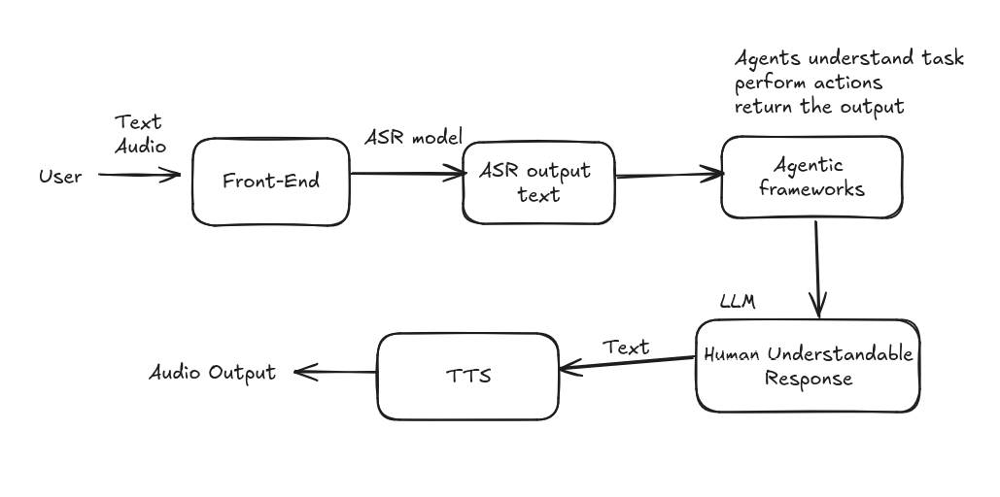

# Project - Telugu AI Assistant

This repository contains data related to Telugu Automatic Speech Recognition and Text-to-Speech conversion, which I utilized in my project on the Telugu AI Assistant.

## About Project
This project aims to develop a Telugu AI Assistant, designed to operate similarly to popular AI assistants like Siri and Alexa. The assistant leverages advanced technologies for Telugu Automatic Speech Recognition (ASR) and Text-to-Speech (TTS) conversion. It allows users to interact with the system through Telugu audio input, enabling it to perform various tasks and provide responses in Telugu. By integrating cutting-edge tools and models, this project seeks to enhance accessibility and user experience for Telugu-speaking individuals.

## Project Workflow

1. **User Input**: The user interacts with the system by providing either text or audio input through the front-end interface.

2. **Automatic Speech Recognition (ASR)**: If the input is in audio format, it is processed by the ASR model to convert the speech into text.

3. **Agentic Frameworks**: The text (from either direct user input or ASR output) is passed to agentic frameworks. These agents understand the task, perform the necessary actions (such as searching for information), and return the output.

4. **Human Understandable Response**: The agents send a report about the completed task (or search results) to a large language model (LLM), which converts it into human-understandable English text.

5. **Text-to-Speech (TTS)**: The English text generated by the LLM is translated into Telugu and then converted to Telugu audio using a TTS model.

6. **Output Delivery**: The final output, whether it's the result of a search or the completion of a task, is delivered back to the user as Telugu audio.

## Repo Contents

This repository consists the data on Telugu Automatic Speech Recognition and Text-to-Speech Parts of the project which i worked on till now.

### Telugu Automatic Speech Recognition (ASR)

**Automatic Speech Recognition** : Automatic Speech Recognition helps us to convert the user spoken audio into the Text.

Since I'm working with Telugu audio, I use Automatic Speech Recognition to transcribe the audio into text. To accomplish this, I started using Hugging Face models designed for Telugu Automatic Speech Recognition.

**Telugu ASR Hugging Face Models** 

There are 3 types of Telugu ASR Models in the Hugging Face platform.
Namely
  1. Whisper Models
  2. Wav2Vec2 Models
  3. Bert Models

These Models can run in both Visual Studio Code and Google Colab. It is Suggested to use Google Colab or Systems that work with GPU to run the Models.

**Whisper Models** : I have worked with 10 of the whisper models from the Hugging Face.
They are
  - [vasista22/whisper-telugu-tiny](https://huggingface.co/vasista22/whisper-telugu-tiny)
  - [vasista22/whisper-telugu-small](https://huggingface.co/vasista22/whisper-telugu-small)
  - [vasista22/whisper-telugu-base](https://huggingface.co/vasista22/whisper-telugu-base)
  - [vasista22/whisper-telugu-medium](https://huggingface.co/vasista22/whisper-telugu-medium)
  - [vasista22/whisper-telugu-large-v2](https://huggingface.co/vasista22/whisper-telugu-large-v2)
  - [kowshik/whisper-telugu-medium](https://huggingface.co/kowshik/whisper-telugu-medium)
  - [kowshik/whisper-telugu-large-v2](https://huggingface.co/kowshik/whisper-telugu-large-v2)
  - [Mukund017/whisper-small-telugu](https://huggingface.co/Mukund017/whisper-small-telugu)
  - [eswardivi/whisper-tiny-fluers_V2_telugu_Augmentation_full_datset_V2_e5](https://huggingface.co/eswardivi/whisper-tiny-fluers_V2_telugu_Augmentation_full_datset_V2_e5)
  - [Anujgr8/Whisper-Anuj-small-Telugu-final](https://huggingface.co/Anujgr8/Whisper-Anuj-small-Telugu-final)

The observations from working with the Whisper models are
  - The Whisper models work better for Audios with Clear audio.
  - The Runtime of these Models takes alot of time. The Runtime of the Whisper models Depends on the size of model we use like Tiny, Small, Base, Medium and Large.
  - Audio with noice or Fast voice have the problems like repeated words, missing words, compressed words.
  - whisper medium and Large Models take more computing power that the Systems CPU can't handle and can lead to System Slowdown or Crashes.

**Wav2Vec2 Models** : The Wav2Vec2 Models which i worked on are
  - [henilp105/wav2vec2-large-xls-r-300m-telugu-asr](https://huggingface.co/henilp105/wav2vec2-large-xls-r-300m-telugu-asr)
  - [anuragshas/wav2vec2-large-xlsr-53-telugu](https://huggingface.co/henilp105/wav2vec2-large-xls-r-300m-telugu-asr)
  - [Anujgr8/wav2vec2-base-Telugu-large](https://huggingface.co/Anujgr8/wav2vec2-base-Telugu-large)
  - [Fredium/wav2vec2-large-xlsr-53-demo-colab-telugu_new](https://huggingface.co/Fredium/wav2vec2-large-xlsr-53-demo-colab-telugu_new)
  - [Hemantrao/wav2vec2-large-xls-r-300m-hindi_telugu-colab](https://huggingface.co/Hemantrao/wav2vec2-large-xls-r-300m-hindi_telugu-colab)
  - [Harveenchadha/vakyansh-wav2vec2-telugu-tem-100](https://huggingface.co/Harveenchadha/vakyansh-wav2vec2-telugu-tem-100)
  - [addy88/wav2vec2-telugu-stt](https://huggingface.co/addy88/wav2vec2-telugu-stt)
  - [krishnateja/wav2vec2-telugu](https://huggingface.co/krishnateja/wav2vec2-telugu)
  - [krishnateja/wav2vec2-telugu_150](https://huggingface.co/krishnateja/wav2vec2-telugu_150)
  - [henilp105/wav2vec2-base-ASR-telugu](https://huggingface.co/henilp105/wav2vec2-base-ASR-telugu)

The observations from working with the Wav2Vec2 Models are
  - Wav2Vec2 Models Works well with the Audio Samples with Clear Audios.
  - These models are not able to work well with the low voice Audios and noicy audios.
  - These take relatively low time compared to the Whisper models.
  - The major problems in the outputs from the models are repeated words, improper telugu transcription, missing text.
  - Three of the Wav2Vec2 models are not working.

**Bert Models** : There are only 2 pre-trained bert models available in the Hugging Face.
They are
  - [Anujgr8/w2v-bert-Telugu-large](https://huggingface.co/Anujgr8/w2v-bert-Telugu-large)
  - [cdactvm/telugu_w2v-bert_model](https://huggingface.co/cdactvm/telugu_w2v-bert_model)

The observations from working with the Bert Models are
  - These models work better for the audio samples with clear audio.
  - The problems in the output text from the bert models are similar to the other two models.
  - Compared to the whisper models, the runtime of bert models are short.

All these models work better for Audio Sample with clear voice and less noice. The Audio Samples with noice have the problems like redundant letters/words, missing words/text, inaccurate text, improper transcription.

I lack the necessary data to fine-tune the models. By fine-tuning the models we can increase the text accuracy greatly.

The models were tested with 30 Audio Samples. The output texts are stored in an Excel file. The outputs are available [Here](https://code.swecha.org/SrimanTetali/Telugu-ASR-Models/-/blob/main/Telugu%20ASR%20Models.xlsx)

### Text-to-Speech (TTS)

**Text-to-Speech** - By using TTS model we can convert the text from any language to Speech.

[Here](https://code.swecha.org/SrimanTetali/Telugu-ASR-Models/-/blob/main/TTS.ipynb) is the Notebook where i worked on the Text-to-Speech.

#### TTS using the Python Libraries
  - **googletrans library** - helps in translating English text to Telugu.
  - **gtts library** - helps in converting telugu text into telugu speech.

This method of Text-to-speech is working good, but the problem is the audio lacks the feelings that we observe in human voices. The output audio is like audio with no emotions in it. 
